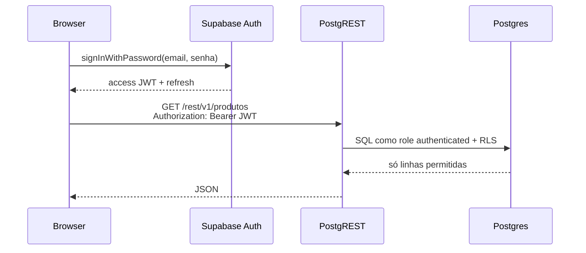

# 07 — Supabase: Auth, Postgres e RLS

**Supabase** = Postgres gerenciado + APIs automáticas + **Auth** (GoTrue) + painel + **Row Level Security (RLS)**.

Você pode usar só o banco, só Auth, ou o pacote completo. Este capítulo foca **Auth + RLS** — autorização na camada de dados.

> Estudo sem projeto live: [`supabase_arquitetura.html`](supabase_arquitetura.html).

---

## Componentes

| Peça | Função |
|------|--------|
| **Postgres** | Dados relacionais; policies RLS |
| **GoTrue** | Registro, login, refresh, JWT |
| **PostgREST** | REST auto-gerado sobre tabelas |
| **Realtime / Storage** | Fora do escopo mínimo de auth |

---

## Fluxo sign-in (mental)



---

## Chaves de API

| Chave | Onde usar | RLS |
|-------|-----------|-----|
| `anon` | Browser / app público | **Respeitada** — políticas filtram |
| `service_role` | **Somente servidor** confiável | **Bypass** total — perigosa |

**Nunca** coloque `service_role` em React/Vite/Next client bundle. Se vazar, qualquer pessoa lê/escreve tudo.

---

## Cliente JS mínimo (snippet)

```js
import { createClient } from "@supabase/supabase-js";

const supabase = createClient(
  process.env.SUPABASE_URL,
  process.env.SUPABASE_ANON_KEY // só anon no client
);

// Cadastro
await supabase.auth.signUp({ email, password });

// Login
const { data, error } = await supabase.auth.signInWithPassword({
  email,
  password,
});

// Sessão atual
const { data: { session } } = await supabase.auth.getSession();
// session.access_token → enviar nas chamadas REST
```

---

## RLS — exemplo

Habilitar RLS na tabela:

```sql
ALTER TABLE produtos ENABLE ROW LEVEL SECURITY;
```

Policy: usuário autenticado só vê os próprios produtos (`dono_id` = UUID do auth.users):

```sql
CREATE POLICY "usuario_ve_so_os_seus"
ON produtos FOR SELECT
TO authenticated
USING (auth.uid() = dono_id);
```

`auth.uid()` vem do JWT que PostgREST repassa ao Postgres.

Insert só se for dono:

```sql
CREATE POLICY "usuario_insere_proprio"
ON produtos FOR INSERT
TO authenticated
WITH CHECK (auth.uid() = dono_id);
```

---

## Quando Supabase substitui Express session

| Cenário | Abordagem |
|---------|-----------|
| SPA + tabelas simples | Supabase client + RLS; sem API Express |
| Lógica de negócio complexa | Express/Fastify + `service_role` no servidor **ou** Edge Functions |
| Form HTML tradicional + CSRF | Ainda pode usar Express session (`04_`) em paralelo |

---

## Segredos

- `.env` local: `SUPABASE_URL`, `SUPABASE_ANON_KEY`
- Servidor: pode precisar `SUPABASE_SERVICE_ROLE_KEY` — **nunca** no frontend
- Não commitar `.env` — ver checklist em [`02_checklist_seguranca_web.md`](02_checklist_seguranca_web.md)

---

## Visual interativo

[`supabase_arquitetura.html`](supabase_arquitetura.html) — clique nas camadas, fluxo JWT, alerta de `service_role` no browser.

Próximo: [`08_comparativo_roll_your_own_vs_baas.md`](08_comparativo_roll_your_own_vs_baas.md).
