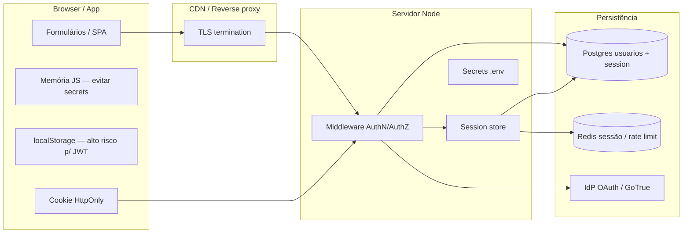
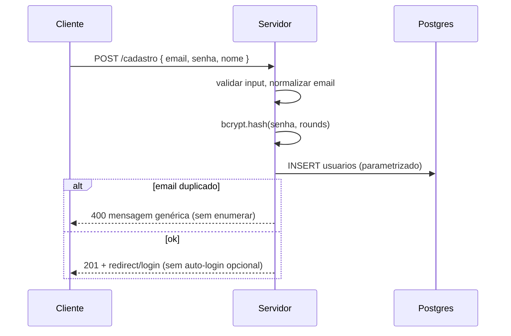
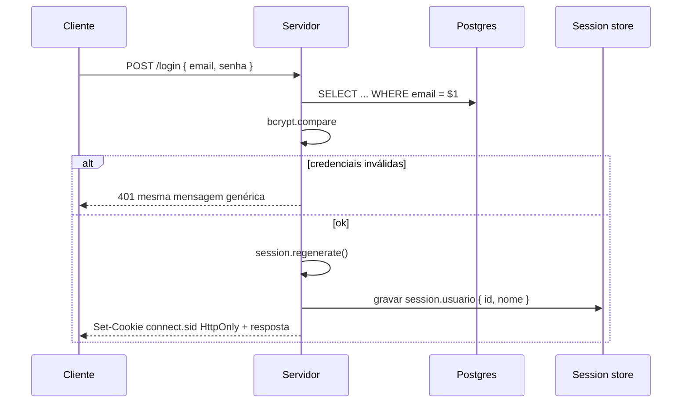
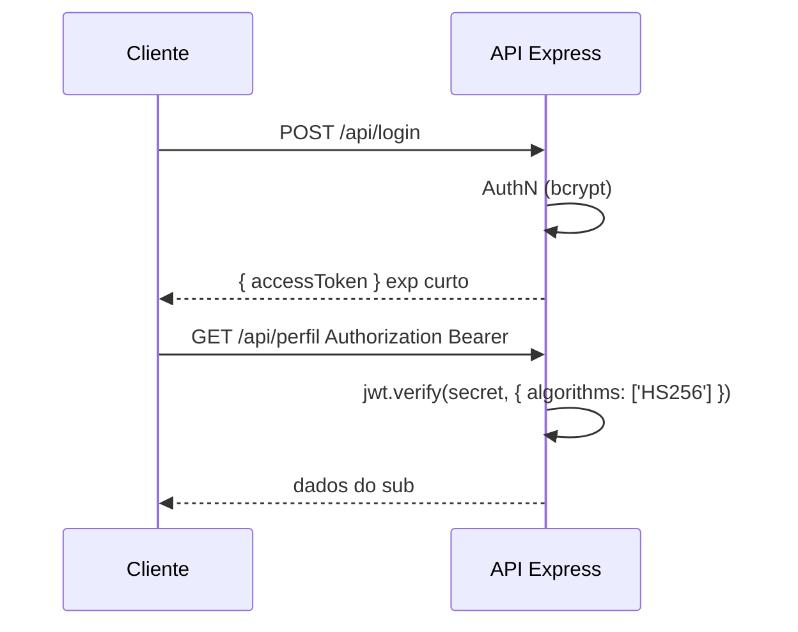

# 09 — Arquitetura de autenticação profissional (ponta a ponta)

Documento **central** do módulo `auth/`: modelo mental, fluxos, onde os dados vivem, ameaças ↔ controles e decisões de arquitetura. Os capítulos `01`–`08` aprofundam peças isoladas; este arquivo amarra tudo como um sistema de produção.

**Pré-requisito:** ter lido [01_autenticacao_autorizacao.md](01_autenticacao_autorizacao.md). **Checklist operacional:** [02_checklist_seguranca_web.md](02_checklist_seguranca_web.md) (referenciado aqui, não duplicado). **Código:** [lab_auth_referencia/](lab_auth_referencia/) (sessão + Postgres); Helmet/CSRF/HTML com views em [`express/08_mongodb_session_seguranca/`](../express/08_mongodb_session_seguranca/).

---

## 1. Modelo mental — cinco conceitos que não se misturam

| Conceito | Pergunta | Exemplo no repo |
|----------|----------|-----------------|
| **Identidade** | Quem é esta pessoa no sistema? | Linha em `usuarios` (`id`, `email`); claim `sub` no JWT |
| **Autenticação (AuthN)** | A credencial apresentada agora prova essa identidade? | `bcrypt.compare` + `session.regenerate` ([lab](lab_auth_referencia/src/controllers/authController.js)); GoTrue no Supabase |
| **Autorização (AuthZ)** | Esta identidade pode fazer **esta** ação neste recurso? | `exigirLogin` (só “logado?”); checar `produto.dono_id === req.session.usuario.id`; RLS `auth.uid() = dono_id` ([07](07_supabase_auth_postgres_rls.md)) |
| **Sessão** | Estado server-side indexado por cookie opaco | `connect.sid` + linha na tabela `session` (lab) ou Mongo ([express/08](../express/08_mongodb_session_seguranca/)) |
| **Token** | Prova portátil assinada (claims no payload) | JWT access/refresh ([05](05_jwt_stateless_apis.md)); JWT do Supabase na header `Authorization` |

**Erro clássico:** confundir “tem cookie” com “pode editar qualquer ID”. AuthN sem AuthZ em toda rota de escrita e em toda query sensível é vulnerabilidade de **Broken Access Control** (OWASP A01).

**401 vs 403**

- **401 Unauthorized** — não há identidade autenticada válida (sem sessão, token ausente/expirado).
- **403 Forbidden** — identidade ok, mas sem permissão para o recurso ou método.

---

## 2. Onde cada dado vive

| Dado | Onde **deve** ficar | Onde **nunca** |
|------|---------------------|----------------|
| Senha em texto puro | — | DB, logs, sessão, JWT payload |
| Hash bcrypt/argon2 | Coluna `senha_hash` no DB | Cookie, `localStorage`, resposta JSON |
| `SESSION_SECRET`, `JWT_SECRET`, pepper | Env do servidor / vault | Git, frontend, imagem Docker pública |
| `service_role` (Supabase) | Job/servidor confiável | Bundle do browser |
| Session id | Cookie `HttpOnly` | URL, `document.cookie` legível por JS |
| Access JWT (curto) | Header `Authorization` ou cookie HttpOnly (BFF) | `localStorage` em app exposto a XSS |
| Refresh token | Cookie HttpOnly + rotação, ou store server-side | Mesma política que access em `localStorage` |
| Papel / permissões | Sessão mínima, claims JWT, ou só consulta com RLS | “Admin=true” só no front |

---

## 3. Fluxos de ponta a ponta

### 3.1 Registro (sign-up)

**Produção:** política de senha (comprimento + lista de senhas vazadas — OWASP sugere checagem contra bases conhecidas); rate limit no cadastro; CAPTCHA sob abuso; verificação de e-mail antes de liberar ações sensíveis (ver §3.5).

**No lab:** [authController.cadastrar](lab_auth_referencia/src/controllers/authController.js).

### 3.2 Login (sessão + cookie)

**Session fixation (CWE-384):** após AuthN bem-sucedida, **novo** id de sessão (`regenerate`) antes de gravar `usuario` — alinhado a OWASP A07 e ao padrão citado na documentação de sessão segura.

**Cookie (express-session):** `httpOnly: true` (padrão da lib); em produção `secure: true` (ou `'auto'`) com `trust proxy` atrás de HTTPS; `sameSite: 'lax'` ou `'strict'` para reduzir CSRF cross-site (não substitui token CSRF em forms HTML — [02](02_checklist_seguranca_web.md)).

**No lab:** [authController.login](lab_auth_referencia/src/controllers/authController.js); visual: [00_mapa_auth.html](00_mapa_auth.html) → “POST /login · sessão + cookie”.

### 3.3 Logout

1. `req.session.destroy()` — invalida no store (Postgres/Mongo/memória).
2. `res.clearCookie('connect.sid')` — remove do browser.
3. Opcional: invalidar refresh tokens no servidor (JWT/Supabase).

Sessão idle/absolute timeout: configurar `maxAge` no cookie e/ou job que limpa sessões antigas no store.

### 3.4 Login stateless (JWT access)

**jsonwebtoken (oficial):** em `verify()`, **liste algoritmos permitidos** — nunca aceite `none` em produção; use segredo ≥ 256 bits para HMAC ou par RSA/ECDSA para verificação assimétrica; valide `exp`/`nbf`/`aud`/`iss` quando aplicável.

**CSRF:** API que aceita **somente** `Authorization: Bearer` **sem** cookie de auth não sofre CSRF clássico (outro site não envia seu header). Se o JWT for colocado em **cookie**, reavalie CSRF + `SameSite`.

**No repo:** [05_jwt_stateless_apis.md](05_jwt_stateless_apis.md); mapa: cenário JWT em [00_mapa_auth.html](00_mapa_auth.html).

### 3.5 Refresh, recuperação de senha, verificação de e-mail

| Fluxo | Ideia profissional | Estado neste repo |
|-------|-------------------|-----------------|
| **Refresh** | Access 5–15 min; refresh 7–30 dias; **rotação** (novo refresh invalida o anterior); store de refresh revogável (Redis/DB) | Teoria em [05](05_jwt_stateless_apis.md); padrão documentado em jsonwebtoken (access + refresh separados); Supabase GoTrue gerencia refresh ([07](07_supabase_auth_postgres_rls.md)) |
| **Recuperação de senha** | Token aleatório de uso único, TTL curto, enviado por canal out-of-band (e-mail); mesma resposta HTTP ao pedir reset (anti-enumeração); invalidar sessões antigas após troca | Conceitual aqui — implementar em projeto próprio ou BaaS |
| **Verificação de e-mail** | Conta `email_verified_at` antes de ações críticas; link com token assinado | Supabase/IdP prontos; roll-your-own = fila + template |
| **Lockout** | Após N falhas: atraso exponencial, bloqueio temporário de conta ou IP; alerta ops | Lab: [rateLimitLogin.js](lab_auth_referencia/src/middlewares/rateLimitLogin.js); desafio completo: [express/08/__test__/03-rate-limit-e-csp.md](../express/08_mongodb_session_seguranca/__test__/03-rate-limit-e-csp.md) |

### 3.6 MFA e OAuth2/OIDC (visão de sistema)

**MFA (multi-factor):** algo que você sabe (senha) + algo que você tem (TOTP app, WebAuthn/passkey) ou algo que você é (biometria no device). Em produção, MFA para contas privilegiadas e para operações de alto risco; recovery codes guardados com hash.

**OAuth2/OIDC:** browser redireciona ao **IdP** (Google, GitHub, empresa); callback com `code`; servidor troca por tokens; você cria ou vincula `usuarios` local. Não implemente OAuth “na mão” sem biblioteca madura (`openid-client`, Passport estratégias mantidas). Supabase expõe provedores sociais via GoTrue — ver [07](07_supabase_auth_postgres_rls.md) e [08](08_comparativo_roll_your_own_vs_baas.md).

---

## 4. Stateful vs stateless vs híbrido

| Modelo | AuthN guardada em | Revogação imediata | Escala horizontal | CSRF em forms HTML |
|--------|-------------------|--------------------|-------------------|---------------------|
| **Stateful** (sessão + cookie) | Store (Postgres, Redis, Mongo) | `destroy` / apagar linha | Store compartilhado obrigatório | **Sim** → token CSRF ([express/08](../express/08_mongodb_session_seguranca/)) |
| **Stateless** (JWT access) | Claims no token | Difícil até expirar; blacklist ou TTL curto | Fácil (sem estado por request) | Não (só Bearer) |
| **Híbrido / BFF** | SPA fala só com BFF; BFF guarda cookie HttpOnly + chama API com JWT curto ou session | BFF invalida cookie | BFF stateful, API pode ser stateless | CSRF no BFF se forms server-rendered |

**Quando cada um (resumo):**

- **Mesmo site, EJS/forms, curso Express:** sessão + CSRF — trilha `04` + `express/08`.
- **API REST + mobile/SPA separados:** JWT access curto + refresh com rotação — `05`.
- **Produto greenfield com AuthZ no banco:** Supabase Auth + RLS — `07` + HTML.
- **Não é “JWT OU sessão” para sempre:** muitos produtos usam sessão no painel admin e JWT na API pública.

---

## 5. Ameaças → controles

| Ameaça | O que acontece | Controles (onde no repo) |
|--------|----------------|---------------------------|
| **XSS** | Script rouba cookie (se não HttpOnly) ou `localStorage` | `httpOnly` ([04](04_sessoes_cookies_express.md)); escape em views; CSP — [express/08](../express/08_mongodb_session_seguranca/) |
| **CSRF** | Site malicioso dispara POST com seu cookie | `csurf` / double-submit após `session` — [02](02_checklist_seguranca_web.md), `express/08` |
| **Session hijacking** | Roubo de `connect.sid` (XSS, MITM sem TLS) | HTTPS, `secure`, `httpOnly`, TTL, rotação pós-login |
| **Session fixation** | Atacante fixa id antes do login da vítima | `session.regenerate()` — lab + [04](04_sessoes_cookies_express.md) |
| **Brute force / credential stuffing** | Muitas senhas / senhas vazadas | Rate limit login — lab + desafio `08`; MFA; mensagem genérica |
| **Account enumeration** | Respostas diferentes revelam e-mails válidos | “Credenciais inválidas”; cadastro genérico — lab |
| **Timing attacks** | Comparar hash string a string | Sempre `bcrypt.compare` — [03](03_senhas_armazenamento_bcrypt.md) |
| **SQL injection** | Input vira SQL | `$1`, `$2` — [06](06_postgres_usuarios_e_queries.md), lab |
| **IDOR** | Trocar `id` na URL e acessar recurso alheio | Checar dono no controller + `WHERE usuario_id = $1` |
| **Privilege escalation** | Usuário comum vira admin | AuthZ por papel no servidor; nunca só no front |
| **JWT `alg: none` / confusion** | Token aceito sem assinatura válida | `jwt.verify` com `algorithms: ['HS256']` explícito — [05](05_jwt_stateless_apis.md) |
| **Token leakage** | JWT em URL, logs, analytics | Só header/cookie HttpOnly; não logar `Authorization` |
| **Vazamento `service_role`** | Cliente lê tudo no Postgres | Só `anon` no browser — [07](07_supabase_auth_postgres_rls.md) |

---

## 6. Checklist “produção” (integrado)

Use [02_checklist_seguranca_web.md](02_checklist_seguranca_web.md) como lista marcável. Este mapa agrupa por fase:

| Fase | Itens críticos |
|------|----------------|
| **Antes do primeiro login** | Secrets em env; bcrypt/argon2; SQL parametrizado; política de senha |
| **Sessão web** | `saveUninitialized: false`; cookie flags; `regenerate` no login; `destroy` no logout; CSRF em forms |
| **API JWT** | TTL curto; refresh com rotação; algoritmos explícitos no verify |
| **Abuso** | Rate limit `POST /login`; logging de falhas sem senha |
| **AuthZ** | Middleware + query/RLS; 403 quando autenticado sem permissão |
| **Deploy** | HTTPS; `trust proxy`; Helmet em prod; erros sem stack para o usuário |

**Helmet + CSRF completos:** não duplicar neste módulo — [`express/08_mongodb_session_seguranca/`](../express/08_mongodb_session_seguranca/).

---

## 7. Decisões de arquitetura

Árvore e tabelas em [08_comparativo_roll_your_own_vs_baas.md](08_comparativo_roll_your_own_vs_baas.md).

| Você precisa | Caminho no repo |
|--------------|-----------------|
| Entender o fino do fino conceitual | **Este arquivo** + `01`–`08` |
| Formulários HTML + flash + CSRF | `express/08` |
| Login bcrypt + sessão Postgres executável | `lab_auth_referencia` |
| Fluxo SQL sem Node | `postgres_fluxo.html` |
| BaaS + RLS | `07` + `supabase_arquitetura.html` |

**Roll your own** só compensa se você vai manter o checklist (OWASP A07: MFA, sessão segura, limites de tentativa, armazenamento de senha forte). **BaaS** transfere OAuth/MFA/refresh, mas **RLS e chaves** continuam sendo sua responsabilidade.

---

## 8. Observabilidade e auditoria (sem vazar segredos)

| Evento | Logar | Não logar |
|--------|-------|-----------|
| Login falha | `timestamp`, `ip`, `user_agent`, `email_hash` ou id opaco | Senha, corpo completo do POST |
| Login sucesso | `user_id`, método (senha/OAuth) | Session id completo, JWT |
| Logout | `user_id` | — |
| Troca de senha | `user_id`, sucesso/falha | Token de reset |
| Erro 500 | `request_id`, stack **só** no servidor | Stack no JSON ao cliente em prod |

**Correlação:** `X-Request-Id` por request. **Alertas:** pico de 401 em `/login`, muitos `EBADCSRFTOKEN`, uso anômalo de `service_role`.

---

## 9. Roteiro de estudo “elite” neste repositório

1. [09_arquitetura_auth_profissional.md](09_arquitetura_auth_profissional.md) (este) — visão sistêmica  
2. [02_checklist_seguranca_web.md](02_checklist_seguranca_web.md) — marcar enquanto pratica  
3. `03` → `04` → rodar ou ler `express/08`  
4. `05` (JWT) → `06` + [postgres_fluxo.html](postgres_fluxo.html)  
5. [lab_auth_referencia/](lab_auth_referencia/) + [LAB_AUTH_REFERENCIA.md do lab](lab_auth_referencia/LAB_AUTH_REFERENCIA.md)  
6. `07` + [supabase_arquitetura.html](supabase_arquitetura.html) → `08`  
7. [__test__/](__test__/) — fixação  

---

## 10. Referências consultadas (Context7)

Documentação atual usada ao redigir recomendações de cookie, JWT e ameaças:

- **OWASP Top 10** — A07 Identification and Authentication Failures; enumeração, sessão pós-login, rate limit, XSS (`textContent`/CSP).
- **express-session** — `cookie.secure`, `sameSite` (`lax`/`strict`/`auto`), `httpOnly`, `trust proxy` em produção.
- **node-jsonwebtoken (Auth0)** — refresh pattern; `verify` com whitelist de algoritmos; rejeitar `none`; rotação de chaves.

Para Supabase Auth/RLS, o capítulo [07](07_supabase_auth_postgres_rls.md) permanece a referência do módulo; consulte também a documentação oficial do projeto Supabase ao implementar.

---

**Anterior:** [08_comparativo_roll_your_own_vs_baas.md](08_comparativo_roll_your_own_vs_baas.md) · **Hub visual:** [00_mapa_auth.html](00_mapa_auth.html) · **Lab:** [lab_auth_referencia/LAB_AUTH_REFERENCIA.md](lab_auth_referencia/LAB_AUTH_REFERENCIA.md)
